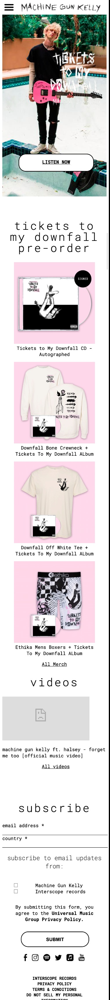

# Procesverslag
**Auteur:** Lisa Nijman (500837599)

Markdown cheat cheet: [Hulp bij het schrijven van Markdown](https://github.com/adam-p/markdown-here/wiki/Markdown-Cheatsheet). Nb. de standaardstructuur en de spartaanse opmaak zijn helemaal prima. Het gaat om de inhoud van je procesverslag. Besteedt de tijd voor pracht en praal aan je website.

## Bronnenlijst
1.https://developer.mozilla.org/en-US/docs/Web/CSS/box-shadow
2. https://codepen.io/yagoestevez/pen/rqamJb
3. https://css-tricks.com/almanac/
4. https://yoksel.github.io/flex-cheatsheet/
5.https://developer.mozilla.org/en-US/docs/Web/CSS/background-image
6. https://css-tricks.com/perfect-full-page-background-image/
7. https://freefrontend.com/css-text-animations/
8. https://dev.to/ljcdev/easy-hamburger-menu-with-js-2do0
9. https://css-tricks.com/custom-list-number-styling/
10. https://css-tricks.com/almanac/properties/t/transform/
11. https://css-tricks.com/almanac/properties/b/background-position/
12. https://codepen.io/dannievinther/pen/NvZjvz?editors=1100
13. https://www.youtube.com/watch?v=br-0i3U1VCA&feature=youtu.be
14.https://www.youtube.com/watch?v=9YffrCViTVk
15.https://css-tricks.com/almanac/selectors/h/hover/
16. https://css-tricks.com/zooming-background-images/
17. https://developer.mozilla.org/en-US/docs/Web/API/GlobalEventHandlers/onclick

## Eindgesprek (week 7/8)

-dit ging goed & dit was lastig-
Ik vond het lastig om zelf dingen te bedenken die ik kon toevoegen om de site uitgebreider te maken. Wat goed ging was het experimenteren met verschillende mogelijkheden voor focus, hover en form.

**Screenshot(s):**

## Voortgang 3 (week 6)

### Stand van zaken
HTML en Css nog een na gelopen, maar geen drastische/nieuwe dingen toegevoegd.

### Agenda voor Meeting

Lisa Nijman                         | Kai van Wezel                 | Jeroen van Hulst |
|---                                |---                            |---
|Tips vragen toevoegingen css + js  | Doorlopen website tot nu toe  | Check HTML

### Verslag van meeting
Tip gekregen vooral dingen toevoegen die er niet zijn. Veel kleine detail toevoegen zoals hover en focus states. Laat wat dingen draaien of veranderen.

## Voortgang 2 (week 5)

### Stand van zaken
Opnieuw begonnen met mijn html en css. Alles compacter en met minder classes weergegeven. Animaties zijn nog lastig en ook de javascript werkt nog niet helemaal. Ik heb de footer veranderd en de ol gestyled op de detail pagina.

### Agenda voor Meeting
|Lisa Nijman            |Kai van Wezel                  |Nienke de Keijzer              |Jeroen van Hulst
|---                    |---                            |---                            |---
|Tips Js                |Verwachting Surface plane      |Advies JS & Css                |Footer
|Tips Animatie          |JS Libraries                   |x                              |Carousel
|Nav werkende           |x                              |x                              |Code ok

### Verslag van meeting
Javascript probleem opgelost. Nav werkt nu wel goed. Met dank aan Danny. HTML & CSS erg netjes. Vooruitgang ten opzichte van vorige keer.

## Voortgang 1 (week 3)

### Stand van zaken

-dit ging goed & dit was lastig-

**Screenshot(s):**
Uitleg homepagina: Redelijk opweg. De form in de footer moet nog bewerkt worden en de transitie van de titels (h2) moeten nog erin gezet worden, ik weet alleen nog niet hoe. Verder kloppen de fonts, de buttons en de gifs.

Uitleg detailpagina: Ook goed opweg. Alleen het probleem dat de pagina groter lijkt dan het device en je hem dus kan uitzoomen. Verder zijn alle albums al juist uitgelijnd en moet ik nog schaduwen toevoegen aan de cover boven aan de pagina.

### Agenda voor meeting

-samen met je groepje opstellen-

| Lisa Nijman                     | Kai van Wezel                           | Nienke de Keijzer             | Jeroen van Hulst                             |
| ---                             | ---                                     | ---                           | ---                                          |
| Navigatie, slider               | Verschil tussen zijn pagina en origineel| Overall look van wat ik nu heb| Website niet te moeielijk voor blauw? andere?|
| Social buttons flexbox          | Semantiek                               | Semantiek                     | Hoe is de code tot nu toe?                   |
| Aanpassen van lijst met kleuren.| Bronnen                                 | Beste aanpak voor straks      | Knoppen formaat op mobile anders dan desktop |

### Verslag van meeting

Aantal dingen losten zich vanzelf op en volgens Jesse was de animation die ik erin wilde zetten te lastig. Verder moest ik het stijlen van de ol maar even googlen.

## Breakdownschets (week 1)

## Intake (week 1)
-uitwerken voor de kick-off werkgroep - begin van de eerste week-

**Je startniveau:** Mijn startniveau is blauw/rood. Ik verwacht in dit blok ook vooral rood & blauw aan te houden, met mogelijk af en toe een beetje zwarte piste tussendoor om te proberen.

**Je focus:** Ik kies voor extra aandacht aan de surface-laag.

**Je opdracht:**
Link: https://www.machinegunkelly.com/

**Screenshot(s) van de eerste pagina (small screen):**

**Screenshot(s) van de tweede pagina (small screen):**

